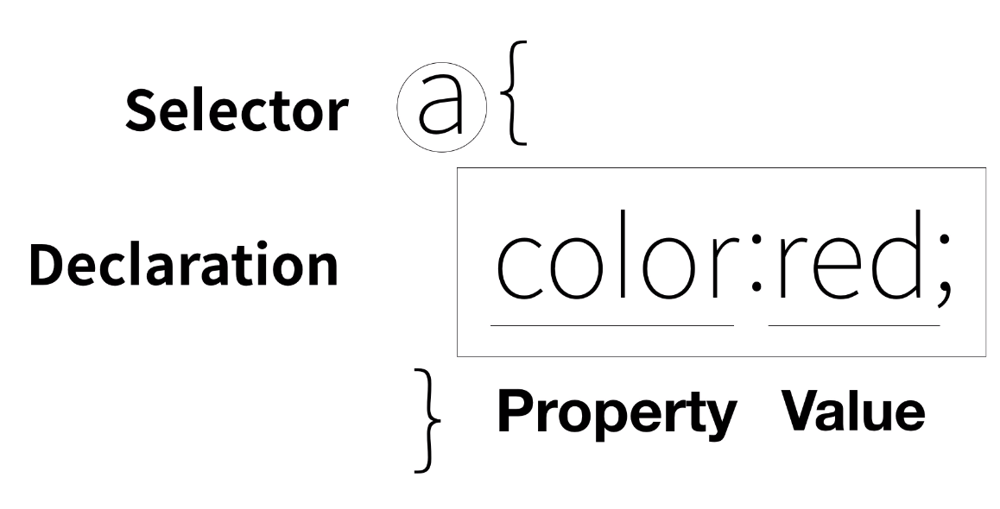

# 웹 개발 기초


## HyoerText Markup Language (HTML)

* web page를 개발하는 데에 있어서 가장 많이 사용되는 **Tag**들은 무엇일까!?

(https://www.advancedwebranking.com/html/)

* 저작권을 걱정하지 않고 쓸 수 있는 이미지 모음: https://unsplash.com/

* **CSS**를 활용하여 style을 추가할 수 있는데 이는 HTML의 tag에서 `<tag명 style="   ">`으로 디자인을 할 수 있다

* HTML은 항목을 만들 수 있도록 `<li> </li>` tag를 제공하는데 이는 보통 다음의 부모 tag로 감싸져 있다. 
    * <ul></ul>: 순서가 없음
    * <ol></ol>: 순서가 있음

* 작성한 page를 브라우저에 띄우는 형식은 `<meta charset='utf-8'>`처럼 지정할 수 있다. 

* 기본적으로 HTML은 다음과 같이 크게 `<!doctype html>`, `<html></html>`, `<head></head>`, 그리고 `<body></body>`의 구조로 구성되어 있도록 약속한다. 

```
<!DOCTYPE html>
<html>

<head>
    <title>WEB1 - html</title>
    <meta charset='utf-8'>
</head>

<body>
    <ol>
        <li>HTML</li>
        <li>CSS</li>
        <li>JavaScript</li>
    </ol>

    <h1>HTML이란</h1>

    <p>HyperText Markup Language (HTML) is the standard markup language for <strong>createing <u>web</u> pages</strong> and web applications.</p>
</body>

</html>
```
* 링크 걸기
    * `target='_blank'`: 새 탭에서 열기
    * `title=''`: 마우스를 올리면 설명 보이기
```
<a href='https://www.w3.org/TR/html5' target='_blank' title='html5 website'>HyperText Markup Language (HTML)</a>
```

* 주석: `<!-- ............................. -->`

* `<link rel='stylesheet' href='style.css'>`의 link 태그를 통해서 css를 적용할 수 있다. 

* 무색/무취의 의미없는 tag
    * <div></div> : 줄바꿈 o
    * <span></span> : 줄바꿈 x

---------------------------------------------------------------------------------------

## CSS

* `<style> </style>` tag는 html에게 내부의 내용을 CSS 문법으로 처리하라는 명령어로 다음과 같이 지정된 tag에 대한 style을 전체적으로 관리할 수 있다. 

```
    <style>
        a {
            color: red;
            text-decoration: none;
        }
    </style>
```
위의 코드를 통해서 `a`라는 모든 tag에 대한 style을 주는 것으로 색을 빨간색으로 하라는 것이며, `;`을 통해서 여러 효과를 한번에 줄 수도 있다.<br>

그리고 특정 tag에 `style="color: red"`으로 속성을 줌으로써 style을 추가할 수 있다.

* css 문법


* selector: `tag`, `class`, `id`로 지정할 수 있고, `class`는 `.`, `id`는 `#`을 앞에 써준다. 그리고 중복된다면 적용되는 css는 `tag` < `class` < `id` 순이다. <u>이 때, `id`의 값은 동일한 page내에서 절대로 중복해서 사용하지 않는다.</u>

* selector를 지정할 때, 중복되는 tag가 발생할 경우가 빈번할 수 있기 때문에 해당하는 tag의 부모 tag를 앞에 지정해 줄 수도 있다. 

예를 들어서, `#article ol`은 article이라는 id로 지정된 tag를 부모로 가지는 ol태그에 대한 CSS를 지정한다. 


* `h1` 태그는 기본적으로 block level element로 블럭을 단위로 잡지만, CSS를 통해서 `display: inline`으로 inline element로 바꿀수도 있다. 

* 웹 브라우저의 크기에 따라서 페이지의 디자인이 바뀔 수 있는데 이를 responsive design이라 하며, **media query**에 대해서 알아보자. 

* `<link rel='stylesheet' href='style.css'>`의 link 태그를 통해서 모든 웹 페이지에 공통적으로 쉽게 적용할 수도 있다! 단순히 모든 웹페이지에 공통적인 디자인을 할 수 있는 것도 있지만 웹페이지에 퍼블리싱할 때에도 css 파일만 캐시로 만들어 공통적으로 적용할 수 있기 때문에 메모리를 줄일 수도 있다!

-------------------------------------------------------------------------------------

## JavaScript

* javascript 문법을 html 내부에 쓰기 위한 방법
    * `<script></script>` 태그로 감싸서 한다.

    * Console: 웹 브라우저의 Console창을 활용해서 손쉽게 javascript를 사용해볼 수 있다.
        * Element창에서 `esc`를 누르면 밑에 conlose창이 뜬다.
        * 이는 이미 많들어져 있는 웹 사이트의 내용에 javascript를 적용하여 볼 수 있다는 점에서 장점을 가진다.

    * event: `onclick`, `onchange`, ...
    ```
        <input type="button" value="night" onclick="
            document.querySelector('body').style.backgroundColor='black';
            document.querySelector('body').style.color='white';
        ">
    ```
    위와 같이 javascript 문법으로 event를 작성한다.

* `document.querySelector()`에서 id값을 지정하기 위해서는 `#`을 붙여야 한다.

* 조건문

* 리팩토링: 중복의 제거
    * `this`
    * 중복되는 변수에 대한 선언 (e.g. `target` )
        ```
            <input id='toggle_night_day' type="button" value="toggle night" onclick="
                var target=document.querySelector(body);
                if(this.value==='toggle_night') 
                {
                    target.style.backgroundColor='black';
                    target.style.color='white';
                    this.value = 'toggle_day'
                } else {
                    target.style.backgroundColor='white';
                    target.style.color='black';
                    this.value = 'toggle_night'    
                }
            ">
        ```

    * 반복문 

    * 함수
        ```
            function <function name> (parameters & arguments) {
                ...

                return ...
            }
        ```

        * `this`, `self` 또는 arguments 주의!!!

    * Object
        * create & iterate
            ```
                <script>
                    var coworkers = {
                        "programmer": "egoing",
                        "designer": "lee"
                    }

                    document.write("Programmer is " + coworkers.programmer + "<br>");
                    document.write("designer is " + coworkers.designer + "<br>");
                    coworkers.bookkeeper = 'kim';
                    document.write("Bookkeeper is " + coworkers.bookkeeper + "<br>");
                    coworkers["Data scientist"] = "taeho";
                    document.write("Data scientist is " + coworkers["Data scientist"] + "<br>");
                </script>

                <script>
                    for(var key in coworkers) {
                        document.write(key + ' is ' + coworkers[key] + "<br>");
                    }
                </script>
            ```

        * property & method
            ```
                <script>
                    coworkers.showAll = function (){
                        for(var key in this) {
                            document.write(key + ': ' + this[key] + '<br>')
                        }
                    }
                    coworkers.showAll();
                </script>
            ```
* 파일로 쪼개서 통합적으로 모든 페이지를 관리하자
    ```
        <script src='color.js'></script>
    ```
        
## references
* [생활코딩 > - WEB1 - HTML&Internet](https://opentutorials.org/module/3135/18437)
* [w3schools](https://www.w3schools.com/)

* Extra to do:
    * document
    * Document Object Model (DOM)
    * ajax: 웹페이지를 리로드하지 않고 정보를 변경하고자 할 때
    * cookie: 웹페이지가 리로드되더라고 현재 상태를 유지하고 싶을 때, 사용자에 대한 개인화된 서비스 제공을 하고 싶을 때 
    * offline web application: 
    * webRTC: 가상통신 웹앱을 만들고 싶을 때
    * webGL: 3차원
    * webVR